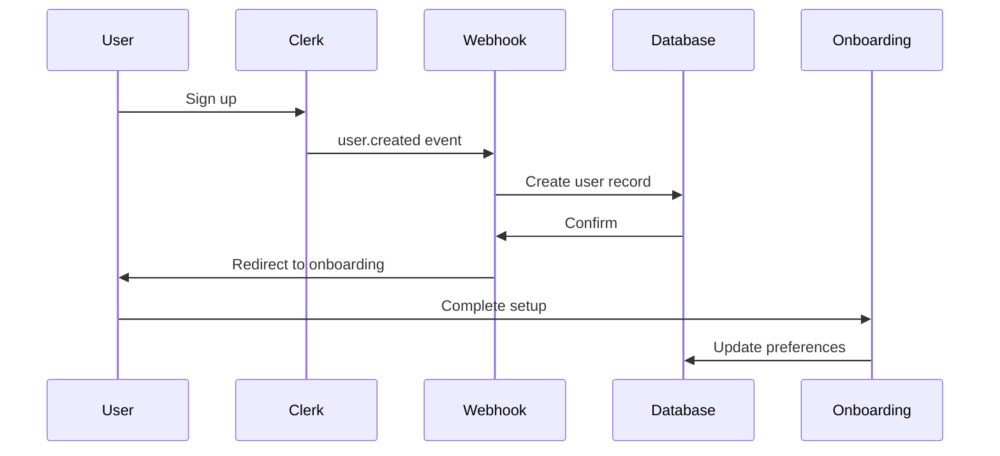
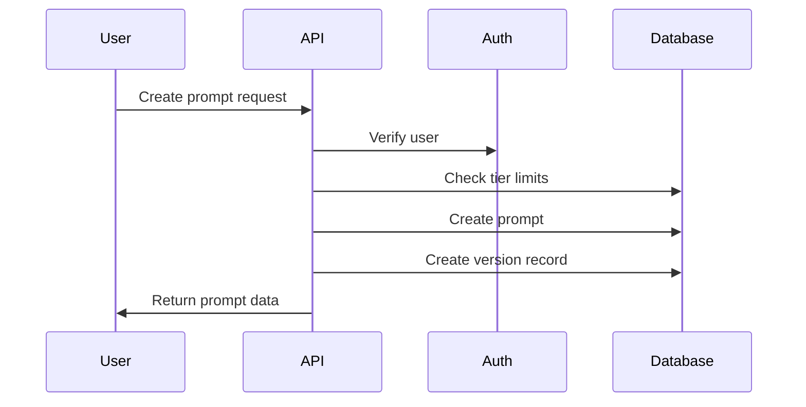
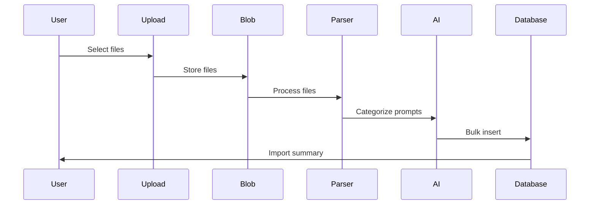

# PromptVault Architecture

## Overview

PromptVault is a modern, enterprise-grade prompt management platform built with Next.js 15, TypeScript, and PostgreSQL. The architecture emphasizes scalability, security, and developer experience while maintaining high performance and reliability.

## Technology Stack

### Core Framework
- **Next.js 15.4.1** with App Router and React 19
- **TypeScript 5** for type safety
- **Turbopack** for fast development builds

### Database & ORM
- **Neon PostgreSQL** with connection pooling
- **Drizzle ORM** for type-safe database operations
- **Database migrations** for schema versioning

### Authentication & Security
- **Clerk** for authentication and user management
- **Middleware-based** route protection
- **Webhook integration** for user sync

### Payments & Subscriptions
- **Stripe** for payment processing
- **Webhook-based** subscription management
- **Tiered pricing** system (Free/Pro/Enterprise)

### AI Integration
- **OpenAI API** for prompt optimization
- **AI-powered** onboarding and categorization
- **Smart import** processing

### File Storage
- **Vercel Blob** for file uploads
- **Secure URL** generation
- **Automatic cleanup** policies

### UI & Styling
- **Tailwind CSS v4** for styling
- **Framer Motion** for animations
- **Lucide React** for icons
- **Custom UI components** with shadcn patterns

## System Architecture

```
┌─────────────────┐     ┌─────────────────┐     ┌─────────────────┐
│                 │     │                 │     │                 │
│   Next.js App   │────▶│   API Routes    │────▶│    Database     │
│   (Frontend)    │     │   (Backend)     │     │    (Neon)       │
│                 │     │                 │     │                 │
└─────────────────┘     └─────────────────┘     └─────────────────┘
         │                       │                       ▲
         │                       │                       │
         ▼                       ▼                       │
┌─────────────────┐     ┌─────────────────┐     ┌─────────────────┐
│                 │     │                 │     │                 │
│     Clerk       │     │    OpenAI       │     │   Drizzle ORM   │
│    (Auth)       │     │     (AI)        │     │                 │
│                 │     │                 │     │                 │
└─────────────────┘     └─────────────────┘     └─────────────────┘
         │                       │
         │                       │
         ▼                       ▼
┌─────────────────┐     ┌─────────────────┐
│                 │     │                 │
│     Stripe      │     │  Vercel Blob    │
│   (Payments)    │     │   (Storage)     │
│                 │     │                 │
└─────────────────┘     └─────────────────┘
```

## Directory Structure

```
promptvault/
├── src/
│   ├── app/                    # Next.js App Router
│   │   ├── api/               # API endpoints
│   │   │   ├── ai/           # AI processing endpoints
│   │   │   ├── billing/      # Stripe integration
│   │   │   ├── import/       # Import processing
│   │   │   ├── optimize/     # Prompt optimization
│   │   │   ├── prompts/      # CRUD operations
│   │   │   ├── share/        # Sharing functionality
│   │   │   └── webhooks/     # Clerk & Stripe webhooks
│   │   ├── dashboard/         # Main app interface
│   │   ├── onboarding/        # User onboarding flow
│   │   ├── prompts/           # Prompt management UI
│   │   ├── settings/          # User settings
│   │   ├── share/             # Public share pages
│   │   └── (auth)/           # Authentication pages
│   ├── components/            # React components
│   │   ├── dashboard/        # Dashboard components
│   │   ├── import-dialog/    # Import UI components
│   │   ├── prompts/          # Prompt components
│   │   └── ui/               # Base UI components
│   ├── lib/                   # Core utilities
│   │   ├── db/               # Database schema & connection
│   │   ├── importers/        # Import parsers
│   │   ├── ai/               # AI utilities
│   │   └── utils/            # Helper functions
│   └── middleware.ts          # Route protection
├── drizzle/                   # Database migrations
├── public/                    # Static assets
└── docs/                      # Documentation
```

## Core Components

### 1. Database Layer

The database uses Drizzle ORM with PostgreSQL, featuring:

**Key Tables**:
- `users` - Extended user profiles with tier information
- `prompts` - Main content storage with folder organization
- `promptVersions` - Git-like version control
- `promptOptimizations` - AI optimization history
- `shares` - Shareable links with expiration
- `importSessions` - Import tracking
- `promptTemplates` - Reusable templates

**Connection Strategy**:
```typescript
// Pooled connection for application
const db = drizzle(sql, { schema });

// Transactions for multi-table operations
await db.transaction(async (tx) => {
  // Atomic operations
});
```

### 2. Authentication System

Clerk provides complete authentication with:
- **Middleware protection** for routes
- **Webhook integration** for user sync
- **Custom auth pages** at `/sign-in` and `/sign-up`
- **Progressive sign-up** flow
- **Session management** with JWT tokens

Protected routes pattern:
```typescript
const isProtectedRoute = createRouteMatcher([
  '/dashboard(.*)',
  '/prompts(.*)',
  '/settings(.*)',
  '/api/prompts(.*)',
]);
```

### 3. API Architecture

All API routes follow consistent patterns:

```typescript
// Standard API route structure
export async function GET(req: Request) {
  // 1. Authentication check
  const { userId } = await auth();
  if (!userId) return new Response("Unauthorized", { status: 401 });

  // 2. Input validation
  const params = validateInput(req);

  // 3. Tier enforcement
  const user = await getUser(userId);
  checkTierLimits(user);

  // 4. Database operation
  const result = await db.transaction(async (tx) => {
    // Operations
  });

  // 5. Response
  return Response.json(result);
}
```

### 4. Import System

Multi-source import system supporting:
- **ChatGPT** exports (JSON)
- **Claude** exports (JSON/JSONL)
- **Gemini** exports
- **Cline** markdown files
- **Cursor** exports
- **Generic files** (JSON/text)

Import flow:
1. File upload to Vercel Blob
2. Parser detection and validation
3. Prompt extraction
4. AI categorization (Pro/Enterprise)
5. Bulk database insertion
6. Duplicate detection

### 5. Tier System

Three-tier pricing model enforced throughout:

```typescript
const TIERS = {
  free: {
    limits: { prompts: 50, aiOptimizations: 0, teamMembers: 1 }
  },
  pro: {
    limits: { prompts: -1, aiOptimizations: -1, teamMembers: 5 }
  },
  enterprise: {
    limits: { prompts: -1, aiOptimizations: -1, teamMembers: -1 }
  }
};
```

### 6. AI Integration

OpenAI integration for:
- **Prompt optimization** with before/after scoring
- **Auto-categorization** during import
- **Smart suggestions** in onboarding
- **Template generation**

Rate limiting and caching implemented for cost control.

## Data Flow Patterns

### 1. User Registration Flow



### 2. Prompt Creation Flow



### 3. Import Processing Flow



## Security Architecture

### 1. Authentication Security
- Clerk handles all authentication
- JWT tokens for session management
- Automatic token refresh
- Secure cookie storage

### 2. API Security
- Route-level protection via middleware
- Input validation with Zod schemas
- SQL injection prevention via Drizzle
- Rate limiting on sensitive endpoints

### 3. Data Security
- Encrypted database connections
- User data isolation
- Secure file uploads
- Sanitized user inputs

### 4. Payment Security
- Stripe handles all payment data
- Webhook signature verification
- No credit card data stored
- PCI compliance via Stripe

## Performance Optimizations

### 1. Database Performance
- Connection pooling for scalability
- Indexed columns for fast queries
- Efficient pagination
- Query optimization

### 2. Frontend Performance
- React Server Components
- Dynamic imports for code splitting
- Image optimization
- Turbopack for fast builds

### 3. API Performance
- Response caching where appropriate
- Batch operations for bulk actions
- Efficient data fetching
- Minimal payload sizes

### 4. AI Performance
- Request batching
- Response caching
- Rate limiting
- Fallback strategies

## Deployment Architecture

### Production Environment
- **Hosting**: Vercel with automatic scaling
- **Database**: Neon PostgreSQL with connection pooling
- **CDN**: Vercel Edge Network
- **Monitoring**: Vercel Analytics

### Development Workflow
1. Local development with hot reload
2. Preview deployments on PR
3. Automatic production deployment on merge
4. Database migrations via CI/CD

## Scalability Considerations

### Horizontal Scaling
- Stateless application design
- Database connection pooling
- Cached responses
- CDN for static assets

### Vertical Scaling
- Optimized database queries
- Efficient data structures
- Minimal memory footprint
- Background job processing

## Future Architecture Considerations

### Planned Enhancements
1. **Redis caching** for improved performance
2. **Background job queue** for heavy operations
3. **Real-time collaboration** with WebSockets
4. **Advanced analytics** pipeline
5. **Plugin system** for extensibility

### Technical Debt
1. Migrate from inline API routes to service classes
2. Implement comprehensive error tracking
3. Add request/response logging
4. Create API versioning strategy
5. Implement rate limiting middleware