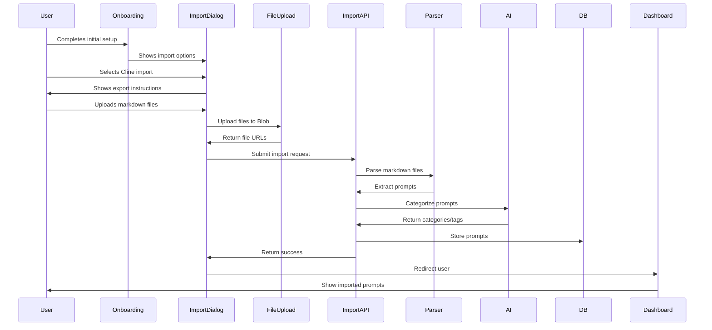
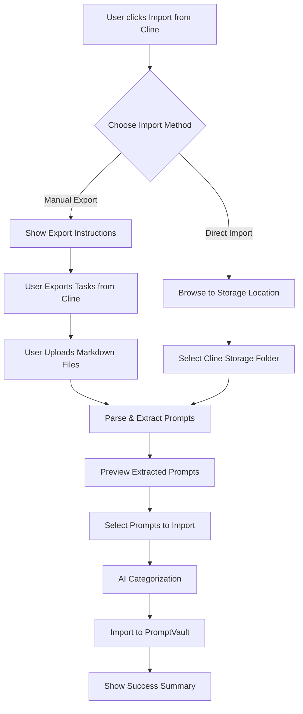
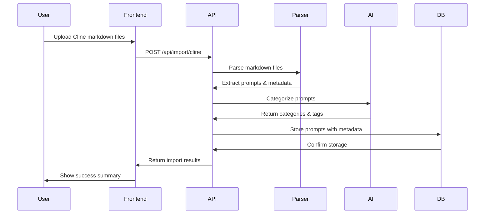

# Cline VSCode Extension Import - Comprehensive Implementation Plan

## Executive Summary

This document outlines the complete implementation plan for integrating Cline VSCode extension task import functionality into PromptVault. Cline is an AI-powered coding assistant that allows users to have interactive conversations with LLMs directly within VSCode. Our implementation will enable users to seamlessly import their Cline task history, extract user prompts, and organize them within PromptVault.

### User Prompt that initiated the creation of this plan
We have recently been working on the implementation of different import options for importing different chat sessions and chat logs from different LLMs and platforms. The goal is to provide a seamless way for users to import any chats or sessions and the application should parse through those chats and sessions to identify and extract all of the actual user prompts so that those can then be ingested, processed, and analyzed by AI so that all the prompts are organized, categorized, labeled, and stored into the users "My Prompts". The user should be able to then easily browse through all of their prompts within their profile. So far, we have the onboarding aspect built out to get some info from the user and then displays all the different import options. The import options have been built to give the guidance to the user on how they need to export, share, or gather the chat logs from each of the different import options as each of them differ to some degree. However, none of the import options have been fully built out yet to actually meet the goal that I outlined above. To ensure that we get this built out in the BEST way possible and COMPLETLY built out with full FUNCTIONALITY and maintaining that modern seamless user experience appeal, we want to work on getting each of these import options built out one by one. That way you can effectively conduct all the necessary research for that specific tool / platform (Claude Desktop, Claude Code, Cline extension in VSCode, Cursor IDE, etc.) to best identify and understand all the different possible share, export, and chat log gathering options to identify the best most efficient, effective, and seamless options. Also, accounting for the ability of the application to be able to successfully handle the ingestion and processing of the selected share, export, etc. methods. Then you can effectively conduct on all the necessary research, designing, and planning to successfully generate a comprehensive implementation plan thats laser focus on just one particular import option and FULLY planning out the ENTIRE implementation of that one option, accounting for optimal and seamless user experience, accounting for the user guidance, when they click on said import option FULLY built out in the BEST possible way to give the most efficient guidance to the user on what they need to do for sharing, exporting, or gathering the chat/session logs from that particular app/platform to supply to our app, accounting for everything that's required for the application to properly handle the ingestion and processing of those chats and logs once the user uploads them or provides a link to them within that particular import options import window, and accounting for the implementation of the AI aspects for effectively parsing and extracting all the actual user prompts from the uploaded chats/logs and organizing, categorizing, labeling, and storing of them. The research, critical thinking, designing, engineering, and planning should all be very meticulous and thorough, really showcasing your leading world-class full-stack software engineering capabilities. To begin, let's have your focus be on the "Cline extension in VSCode." I know you'll conduct your own extensive research, but as a quick overview, Cline is an extension in VSCode that enables users to seamlessly integrate and interact with multiple Large Language Model (LLM) providers, such as OpenAI, Anthropic, and Grok. Users can initiate "Tasks," essentially dedicated chats or interactive sessions, with their chosen LLM provider. Within these tasks, users can iteratively prompt the LLM, guiding it through the process of developing code, debugging issues, generating documentation, brainstorming new ideas, or handling complex, multi-step workflows directly within their development environment. I believe, Cline includes a feature for exporting a tasks logs and it also stores each tasks logs inside of some folder on the users workstation. At any rate, proceed conducting all your research, ultrathinking, designing, engineering, and planning, to produce a comprehensive implementation plan for the Cline VSCode import option. Remember that you can use the sequential-thinking MCP server for complex planning and solutioning, brave-search MCP server for searching the web and conducting research, filesystem MCP server for file system operations, plus any of your own built in tools. REMAIN EXTREMELY METICULOUS, THOROUGH, AND OPERATING LIKE THE LEADING TOP-TIER WORLD-CLASS SENIOR SOFTWARE ARCHITECT THAT YOU ARE!

## Table of Contents

1. [Technical Overview](#technical-overview)
2. [Core Infrastructure Requirements](#core-infrastructure-requirements)
3. [User Journey & Experience](#user-journey--experience)
4. [System Architecture](#system-architecture)
5. [Implementation Details](#implementation-details)
6. [AI Processing Pipeline](#ai-processing-pipeline)
7. [Error Handling & Edge Cases](#error-handling--edge-cases)
8. [Testing Strategy](#testing-strategy)
9. [Timeline & Milestones](#timeline--milestones)
10. [Success Metrics](#success-metrics)

## Technical Overview

### Current Understanding

Based on research, Cline provides:
- Task-based conversations with various LLM providers
- History management with task viewing and searching
- Individual task export to markdown format
- No documented bulk export functionality
- Storage location not publicly documented

### Implementation Approach

We will implement a dual-approach system:
1. **Manual Export Method**: Guide users through exporting individual tasks
2. **Direct Import Method** (Future Enhancement): Attempt to locate and read Cline's local storage

## Core Infrastructure Requirements

### Current State
The existing import system has UI components but lacks functional backend implementation. No imports currently work - users can see import options but nothing happens when they try to use them.

### Required Infrastructure Components

#### 1. Base Import Utilities
```typescript
// src/lib/import-utils.ts
// Core utilities for all import operations

export interface ImportOptions {
  skipDuplicates?: boolean;
  autoCategize?: boolean;
  targetFolder?: string;
  batchSize?: number;
}

export interface ImportedPrompt {
  id: string;
  name: string;
  content: string;
  folder: string;
  tags: string[];
  metadata: any;
}

export async function createImportSession(
  userId: string,
  source: ImportSource,
  metadata: any
): Promise<ImportSession> {
  const [session] = await db.insert(importSessions).values({
    userId,
    source,
    metadata,
    importedCount: 0,
    skippedCount: 0,
    createdAt: new Date()
  }).returning();
  
  return session;
}

export async function createTagsForPrompt(
  promptId: string,
  tagNames: string[],
  userId: string
): Promise<void> {
  for (const tagName of tagNames) {
    // Find or create tag
    let tag = await db.query.tags.findFirst({
      where: and(eq(tags.userId, userId), eq(tags.name, tagName))
    });
    
    if (!tag) {
      const [newTag] = await db.insert(tags).values({
        name: tagName,
        userId,
        color: generateTagColor(tagName)
      }).returning();
      tag = newTag;
    }
    
    // Link tag to prompt
    await db.insert(promptTags).values({
      promptId,
      tagId: tag.id
    }).onConflictDoNothing();
  }
}
```

#### 2. File Upload Infrastructure
```typescript
// src/app/api/import/upload/route.ts
// Handles file uploads to Vercel Blob storage

import { put } from '@vercel/blob';
import { nanoid } from 'nanoid';

export async function POST(req: Request) {
  const { userId } = await auth();
  if (!userId) return new Response('Unauthorized', { status: 401 });
  
  const formData = await req.formData();
  const files = formData.getAll('files') as File[];
  
  const uploadedFiles = await Promise.all(
    files.map(async (file) => {
      const bytes = await file.arrayBuffer();
      const buffer = Buffer.from(bytes);
      
      const blob = await put(
        `imports/${userId}/${nanoid()}-${file.name}`,
        buffer,
        { access: 'public' }
      );
      
      return {
        url: blob.url,
        name: file.name,
        size: file.size
      };
    })
  );
  
  return Response.json({ files: uploadedFiles });
}
```

#### 3. Import Progress Tracking
```typescript
// src/lib/import-progress.ts
// Real-time progress updates using Server-Sent Events

export class ImportProgressTracker {
  private progress: Map<string, ImportProgress> = new Map();
  
  updateProgress(sessionId: string, update: Partial<ImportProgress>) {
    const current = this.progress.get(sessionId) || {
      total: 0,
      processed: 0,
      imported: 0,
      skipped: 0,
      errors: [],
      status: 'processing'
    };
    
    this.progress.set(sessionId, { ...current, ...update });
  }
  
  getProgress(sessionId: string): ImportProgress | null {
    return this.progress.get(sessionId) || null;
  }
  
  complete(sessionId: string, summary: ImportSummary) {
    this.updateProgress(sessionId, {
      status: 'complete',
      summary
    });
  }
}
```

#### 4. Onboarding to Dashboard Flow
```typescript
// src/app/onboarding/complete/route.ts
// Handles post-import redirect to dashboard

export async function POST(req: Request) {
  const { userId } = await auth();
  if (!userId) return new Response('Unauthorized', { status: 401 });
  
  const { importSessionId } = await req.json();
  
  // Mark onboarding as complete
  await db.update(users)
    .set({ 
      onboardingCompleted: true,
      lastImportSessionId: importSessionId 
    })
    .where(eq(users.id, userId));
  
  return Response.json({ 
    redirect: '/dashboard',
    message: 'Import successful! Redirecting to your dashboard...' 
  });
}
```

#### 5. Database Migrations
```sql
-- migrations/add_import_features.sql

-- Add import-related columns to users table
ALTER TABLE users 
ADD COLUMN onboarding_completed BOOLEAN DEFAULT FALSE,
ADD COLUMN last_import_session_id UUID;

-- Add indexes for better performance
CREATE INDEX idx_import_sessions_user_created 
ON import_sessions(user_id, created_at DESC);

CREATE INDEX idx_prompts_user_folder 
ON prompts(user_id, folder);

CREATE INDEX idx_prompt_tags_prompt 
ON prompt_tags(prompt_id);
```

### Vercel Configuration

#### 1. Environment Variables
```bash
# Additional required environment variables
BLOB_READ_WRITE_TOKEN=vercel_blob_token_here
VERCEL_URL=https://aipromptvault.app
NEXT_PUBLIC_VERCEL_URL=https://aipromptvault.app
```

#### 2. Vercel Functions Configuration
```json
// vercel.json
{
  "functions": {
    "src/app/api/import/*/route.ts": {
      "maxDuration": 60
    },
    "src/app/api/optimize/route.ts": {
      "maxDuration": 30
    }
  }
}
```

### Complete Import Flow Architecture



## User Journey & Experience

### Import Flow



### UI Components

#### 1. ClineImportDialog Component

```typescript
interface ClineImportDialogProps {
  isOpen: boolean;
  onClose: () => void;
  onImportComplete: (count: number) => void;
}

// Key features:
// - Tabbed interface for Manual/Direct import
// - Visual instructions with screenshots
// - Multi-file upload with drag-and-drop
// - Progress tracking
// - Preview interface
```

#### 2. Visual Guide Section

The dialog will include:
- Step-by-step screenshots showing:
  - How to access Cline's History button
  - How to export individual tasks
  - Expected markdown file format
- Video tutorial link (future enhancement)
- Troubleshooting tips

#### 3. File Upload Interface

```typescript
interface FileUploadSectionProps {
  onFilesSelected: (files: File[]) => void;
  maxFiles?: number;
  acceptedFormats: string[];
}

// Features:
// - Drag-and-drop zone
// - Multiple file selection
// - File validation
// - Upload progress per file
// - Remove individual files
```

## System Architecture

### Frontend Components

```
src/components/import-dialog/
├── cline-import-dialog.tsx       # Main dialog component
├── cline-export-guide.tsx        # Visual instructions
├── cline-file-uploader.tsx       # Multi-file upload component
├── cline-prompt-preview.tsx      # Preview extracted prompts
└── cline-import-settings.tsx     # Import configuration options
```

### Backend Structure

```
src/lib/importers/
├── cline.ts                      # Cline-specific parser
├── cline-markdown-parser.ts      # Markdown parsing logic
└── cline-storage-reader.ts       # Direct storage access (future)

src/app/api/import/
└── cline/
    └── route.ts                  # Cline import endpoint
```

### Data Flow



## Implementation Details

### 1. Markdown Parser Implementation

```typescript
// src/lib/importers/cline-markdown-parser.ts

interface ClineConversation {
  taskName: string;
  timestamp: Date;
  messages: Array<{
    role: 'user' | 'assistant' | 'system';
    content: string;
    timestamp?: Date;
  }>;
}

export class ClineMarkdownParser {
  private static readonly USER_PATTERN = /^##\s*User\s*$/im;
  private static readonly ASSISTANT_PATTERN = /^##\s*Assistant\s*$/im;
  private static readonly TASK_PATTERN = /^#\s*Task:\s*(.+)$/im;
  private static readonly DATE_PATTERN = /Date:\s*(.+)$/im;

  static parse(markdownContent: string): ClineConversation {
    const lines = markdownContent.split('\n');
    const conversation: ClineConversation = {
      taskName: this.extractTaskName(lines),
      timestamp: this.extractTimestamp(lines),
      messages: []
    };

    let currentRole: 'user' | 'assistant' | null = null;
    let currentContent: string[] = [];

    for (const line of lines) {
      if (this.USER_PATTERN.test(line)) {
        if (currentRole && currentContent.length > 0) {
          conversation.messages.push({
            role: currentRole,
            content: currentContent.join('\n').trim()
          });
        }
        currentRole = 'user';
        currentContent = [];
      } else if (this.ASSISTANT_PATTERN.test(line)) {
        if (currentRole && currentContent.length > 0) {
          conversation.messages.push({
            role: currentRole,
            content: currentContent.join('\n').trim()
          });
        }
        currentRole = 'assistant';
        currentContent = [];
      } else if (currentRole) {
        currentContent.push(line);
      }
    }

    // Add the last message
    if (currentRole && currentContent.length > 0) {
      conversation.messages.push({
        role: currentRole,
        content: currentContent.join('\n').trim()
      });
    }

    return conversation;
  }

  static extractUserPrompts(conversation: ClineConversation): ExtractedPrompt[] {
    return conversation.messages
      .filter(msg => msg.role === 'user')
      .map((msg, index) => ({
        name: this.generatePromptName(msg.content, conversation.taskName, index),
        content: msg.content,
        metadata: {
          source: 'cline' as const,
          conversationId: `cline-${conversation.timestamp.getTime()}-${index}`,
          conversationTitle: conversation.taskName,
          timestamp: conversation.timestamp.getTime(),
          model: 'unknown', // Cline doesn't export model info
          messageIndex: index
        }
      }));
  }

  private static generatePromptName(content: string, taskName: string, index: number): string {
    // Try to extract a meaningful name from the prompt content
    const firstLine = content.split('\n')[0].trim();
    
    if (firstLine.length > 0 && firstLine.length <= 100) {
      return firstLine;
    } else if (firstLine.length > 100) {
      return firstLine.substring(0, 97) + '...';
    } else {
      return `${taskName} - Prompt ${index + 1}`;
    }
  }

  private static extractTaskName(lines: string[]): string {
    for (const line of lines) {
      const match = line.match(this.TASK_PATTERN);
      if (match) {
        return match[1].trim();
      }
    }
    return 'Untitled Cline Task';
  }

  private static extractTimestamp(lines: string[]): Date {
    for (const line of lines) {
      const match = line.match(this.DATE_PATTERN);
      if (match) {
        const date = new Date(match[1].trim());
        if (!isNaN(date.getTime())) {
          return date;
        }
      }
    }
    return new Date();
  }
}
```

### 2. Cline Importer Integration

```typescript
// src/lib/importers/cline.ts

import { ExtractedPrompt } from './index';
import { ClineMarkdownParser } from './cline-markdown-parser';

export function validateClineExport(content: string): boolean {
  try {
    // Check for Cline-specific markdown patterns
    const hasTaskHeader = /^#\s*Task:/im.test(content);
    const hasUserSections = /^##\s*User\s*$/im.test(content);
    const hasAssistantSections = /^##\s*Assistant\s*$/im.test(content);
    
    return hasTaskHeader || (hasUserSections && hasAssistantSections);
  } catch {
    return false;
  }
}

export function parseClineExport(content: string): ExtractedPrompt[] {
  try {
    const conversation = ClineMarkdownParser.parse(content);
    return ClineMarkdownParser.extractUserPrompts(conversation);
  } catch (error) {
    console.error('Error parsing Cline export:', error);
    return [];
  }
}

// For future direct storage access
export async function parseClineStorage(storagePath: string): Promise<ExtractedPrompt[]> {
  // TODO: Implement direct storage reading
  // This will require reverse-engineering Cline's storage format
  throw new Error('Direct storage import not yet implemented');
}
```

### 3. API Endpoint Implementation

```typescript
// src/app/api/import/cline/route.ts

import { auth } from "@clerk/nextjs/server";
import { db } from "@/lib/db";
import { z } from "zod";
import { PromptImporter } from "@/lib/importers";
import { createImportSession, processImportBatch } from "@/lib/import-utils";

const clineImportSchema = z.object({
  files: z.array(z.object({
    name: z.string(),
    content: z.string(),
    size: z.number()
  })),
  options: z.object({
    skipDuplicates: z.boolean().optional(),
    autoCategize: z.boolean().optional(),
    targetFolder: z.string().optional()
  }).optional()
});

export async function POST(req: Request) {
  try {
    const { userId } = await auth();
    if (!userId) {
      return new Response("Unauthorized", { status: 401 });
    }

    const body = await req.json();
    const { files, options } = clineImportSchema.parse(body);

    // Create import session
    const session = await createImportSession(userId, 'cline', {
      fileCount: files.length,
      totalSize: files.reduce((sum, f) => sum + f.size, 0)
    });

    // Process each file
    const results = await Promise.all(
      files.map(async (file) => {
        const result = await PromptImporter.importFromFile(
          new File([file.content], file.name, { type: 'text/markdown' }),
          'cline'
        );
        return result;
      })
    );

    // Aggregate results
    const allPrompts = results.flatMap(r => r.prompts);
    const allErrors = results.flatMap(r => r.errors);
    const allWarnings = results.flatMap(r => r.warnings);

    // Check for duplicates if not skipping
    let uniquePrompts = allPrompts;
    if (!options?.skipDuplicates) {
      const existing = await db.query.prompts.findMany({
        where: eq(prompts.userId, userId)
      });
      
      const { unique, duplicates } = PromptImporter.detectDuplicates(
        allPrompts,
        existing
      );
      
      uniquePrompts = unique;
      if (duplicates.length > 0) {
        allWarnings.push(`${duplicates.length} duplicate prompts detected and skipped`);
      }
    }

    // Import prompts with AI categorization
    const imported = await processImportBatch(
      uniquePrompts,
      userId,
      session.id,
      {
        autoCategize: options?.autoCategize ?? true,
        targetFolder: options?.targetFolder
      }
    );

    // Update import session
    await db.update(importSessions)
      .set({
        importedCount: imported.length,
        skippedCount: allPrompts.length - imported.length,
        metadata: {
          errors: allErrors,
          warnings: allWarnings,
          processingTime: Date.now() - session.createdAt.getTime()
        }
      })
      .where(eq(importSessions.id, session.id));

    return Response.json({
      success: true,
      imported: imported.length,
      skipped: allPrompts.length - imported.length,
      errors: allErrors,
      warnings: allWarnings,
      sessionId: session.id
    });

  } catch (error) {
    console.error('Cline import error:', error);
    
    if (error instanceof z.ZodError) {
      return Response.json(
        { error: 'Invalid request data', details: error.errors },
        { status: 400 }
      );
    }

    return Response.json(
      { error: 'Failed to import Cline tasks' },
      { status: 500 }
    );
  }
}
```

### 4. Frontend Dialog Implementation

```typescript
// src/components/import-dialog/cline-import-dialog.tsx

"use client";

import { useState, useCallback } from "react";
import { useDropzone } from "react-dropzone";
import { FileText, Upload, AlertCircle, CheckCircle, Loader2 } from "lucide-react";
import { Button } from "@/components/ui/button";
import { toast } from "sonner";
import ImportProgress from "./import-progress";

interface ClineImportDialogProps {
  isOpen: boolean;
  onClose: () => void;
  onImportComplete: (count: number) => void;
}

interface ImportFile {
  file: File;
  status: 'pending' | 'processing' | 'success' | 'error';
  error?: string;
}

export default function ClineImportDialog({
  isOpen,
  onClose,
  onImportComplete
}: ClineImportDialogProps) {
  const [files, setFiles] = useState<ImportFile[]>([]);
  const [isProcessing, setIsProcessing] = useState(false);
  const [importResults, setImportResults] = useState<any>(null);
  const [showInstructions, setShowInstructions] = useState(true);

  const onDrop = useCallback((acceptedFiles: File[]) => {
    const newFiles = acceptedFiles.map(file => ({
      file,
      status: 'pending' as const
    }));
    setFiles(prev => [...prev, ...newFiles]);
    setShowInstructions(false);
  }, []);

  const { getRootProps, getInputProps, isDragActive } = useDropzone({
    onDrop,
    accept: {
      'text/markdown': ['.md', '.markdown']
    },
    multiple: true
  });

  const processImport = async () => {
    setIsProcessing(true);

    try {
      // Read all files
      const fileContents = await Promise.all(
        files.map(async ({ file }) => ({
          name: file.name,
          content: await file.text(),
          size: file.size
        }))
      );

      // Send to API
      const response = await fetch('/api/import/cline', {
        method: 'POST',
        headers: { 'Content-Type': 'application/json' },
        body: JSON.stringify({
          files: fileContents,
          options: {
            skipDuplicates: false,
            autoCategize: true
          }
        })
      });

      const result = await response.json();

      if (!response.ok) {
        throw new Error(result.error || 'Import failed');
      }

      setImportResults(result);
      toast.success(`Successfully imported ${result.imported} prompts`);
      onImportComplete(result.imported);

    } catch (error) {
      console.error('Import error:', error);
      toast.error('Failed to import Cline tasks');
    } finally {
      setIsProcessing(false);
    }
  };

  const removeFile = (index: number) => {
    setFiles(prev => prev.filter((_, i) => i !== index));
  };

  if (!isOpen) return null;

  return (
    <div className="fixed inset-0 bg-black/50 flex items-center justify-center p-4 z-50">
      <div className="bg-white dark:bg-gray-800 rounded-lg max-w-4xl w-full max-h-[90vh] overflow-hidden">
        <div className="p-6 border-b">
          <h2 className="text-2xl font-bold">Import from Cline</h2>
          <p className="text-gray-600 dark:text-gray-400 mt-1">
            Import your Cline task history and conversations
          </p>
        </div>

        <div className="p-6 overflow-y-auto max-h-[calc(90vh-200px)]">
          {showInstructions && (
            <div className="mb-6 space-y-4">
              <div className="bg-blue-50 dark:bg-blue-900/20 border border-blue-200 dark:border-blue-800 rounded-lg p-4">
                <h3 className="font-semibold text-blue-900 dark:text-blue-100 mb-2">
                  How to Export from Cline
                </h3>
                <ol className="space-y-2 text-sm text-blue-800 dark:text-blue-200">
                  <li className="flex items-start">
                    <span className="font-semibold mr-2">1.</span>
                    Open VSCode and click on the Cline icon in the sidebar
                  </li>
                  <li className="flex items-start">
                    <span className="font-semibold mr-2">2.</span>
                    Click the "History" button at the top of the Cline panel
                  </li>
                  <li className="flex items-start">
                    <span className="font-semibold mr-2">3.</span>
                    Hover over a task you want to export - an export button will appear
                  </li>
                  <li className="flex items-start">
                    <span className="font-semibold mr-2">4.</span>
                    Click the export button to save the task as a markdown file
                  </li>
                  <li className="flex items-start">
                    <span className="font-semibold mr-2">5.</span>
                    Repeat for each task you want to import
                  </li>
                </ol>
              </div>

              <div className="bg-amber-50 dark:bg-amber-900/20 border border-amber-200 dark:border-amber-800 rounded-lg p-4">
                <div className="flex items-start">
                  <AlertCircle className="w-5 h-5 text-amber-600 mt-0.5 mr-2 flex-shrink-0" />
                  <div className="text-sm text-amber-800 dark:text-amber-200">
                    <p className="font-semibold mb-1">Note:</p>
                    <p>Cline currently only supports exporting individual tasks. You'll need to export each task separately and upload multiple files here.</p>
                  </div>
                </div>
              </div>
            </div>
          )}

          {/* File Upload Area */}
          <div
            {...getRootProps()}
            className={`border-2 border-dashed rounded-lg p-8 text-center cursor-pointer transition-colors ${
              isDragActive
                ? 'border-blue-500 bg-blue-50 dark:bg-blue-900/20'
                : 'border-gray-300 dark:border-gray-600 hover:border-gray-400'
            }`}
          >
            <input {...getInputProps()} />
            <Upload className="w-12 h-12 mx-auto mb-4 text-gray-400" />
            <p className="text-lg font-medium mb-2">
              {isDragActive
                ? 'Drop your Cline export files here'
                : 'Drag & drop Cline export files here'}
            </p>
            <p className="text-sm text-gray-600 dark:text-gray-400 mb-4">
              or click to browse your files
            </p>
            <p className="text-xs text-gray-500">
              Supports multiple .md files
            </p>
          </div>

          {/* File List */}
          {files.length > 0 && (
            <div className="mt-6">
              <h3 className="font-semibold mb-3">Selected Files ({files.length})</h3>
              <div className="space-y-2">
                {files.map((importFile, index) => (
                  <div
                    key={index}
                    className="flex items-center justify-between p-3 bg-gray-50 dark:bg-gray-700 rounded-lg"
                  >
                    <div className="flex items-center">
                      <FileText className="w-4 h-4 mr-2 text-gray-500" />
                      <span className="text-sm">{importFile.file.name}</span>
                      <span className="text-xs text-gray-500 ml-2">
                        ({(importFile.file.size / 1024).toFixed(1)} KB)
                      </span>
                    </div>
                    {!isProcessing && (
                      <button
                        onClick={() => removeFile(index)}
                        className="text-red-600 hover:text-red-700 text-sm"
                      >
                        Remove
                      </button>
                    )}
                    {importFile.status === 'success' && (
                      <CheckCircle className="w-4 h-4 text-green-600" />
                    )}
                    {importFile.status === 'error' && (
                      <AlertCircle className="w-4 h-4 text-red-600" />
                    )}
                  </div>
                ))}
              </div>
            </div>
          )}

          {/* Import Results */}
          {importResults && (
            <div className="mt-6 p-4 bg-green-50 dark:bg-green-900/20 border border-green-200 dark:border-green-800 rounded-lg">
              <h3 className="font-semibold text-green-900 dark:text-green-100 mb-2">
                Import Complete!
              </h3>
              <div className="space-y-1 text-sm text-green-800 dark:text-green-200">
                <p>✓ Imported: {importResults.imported} prompts</p>
                {importResults.skipped > 0 && (
                  <p>⚠ Skipped: {importResults.skipped} duplicates</p>
                )}
                {importResults.warnings?.map((warning: string, i: number) => (
                  <p key={i} className="text-amber-700 dark:text-amber-300">
                    ⚠ {warning}
                  </p>
                ))}
              </div>
            </div>
          )}
        </div>

        <div className="p-6 border-t flex justify-between">
          <Button variant="ghost" onClick={onClose} disabled={isProcessing}>
            {importResults ? 'Close' : 'Cancel'}
          </Button>
          {!importResults && (
            <Button
              onClick={processImport}
              disabled={files.length === 0 || isProcessing}
            >
              {isProcessing ? (
                <>
                  <Loader2 className="w-4 h-4 mr-2 animate-spin" />
                  Processing...
                </>
              ) : (
                `Import ${files.length} File${files.length !== 1 ? 's' : ''}`
              )}
            </Button>
          )}
        </div>
      </div>
    </div>
  );
}
```

## AI Processing Pipeline

### Prompt Analysis & Categorization

```typescript
// src/lib/ai/cline-prompt-analyzer.ts

interface PromptAnalysis {
  category: string;
  tags: string[];
  complexity: 'simple' | 'moderate' | 'complex';
  suggestedFolder: string;
  suggestedName: string;
  relatedPrompts: string[];
}

export async function analyzeClinePrompt(
  prompt: ExtractedPrompt,
  existingPrompts: any[]
): Promise<PromptAnalysis> {
  const response = await openai.chat.completions.create({
    model: 'gpt-4o-mini',
    messages: [
      {
        role: 'system',
        content: `You are analyzing a prompt extracted from Cline (VSCode AI assistant).
Analyze the prompt and provide categorization and metadata.

Categories to consider:
- Code Generation
- Debugging
- Refactoring
- Documentation
- Testing
- Architecture
- DevOps
- Data Processing
- UI/UX
- Other

Return JSON with this structure:
{
  "category": "primary category",
  "tags": ["tag1", "tag2", "tag3"],
  "complexity": "simple|moderate|complex",
  "suggestedFolder": "folder/path",
  "suggestedName": "descriptive name for the prompt",
  "relatedPrompts": ["id1", "id2"] // IDs of similar existing prompts
}`
      },
      {
        role: 'user',
        content: `Analyze this prompt:

${prompt.content}

Task context: ${prompt.metadata.conversationTitle}
Timestamp: ${new Date(prompt.metadata.timestamp).toISOString()}

Existing user prompts for similarity check:
${existingPrompts.slice(0, 10).map(p => `- ${p.id}: ${p.name}`).join('\n')}`
      }
    ],
    temperature: 0.3,
    response_format: { type: "json_object" }
  });

  return JSON.parse(response.choices[0].message.content || '{}');
}
```

### Batch Processing with Rate Limiting

```typescript
// src/lib/import-utils.ts

export async function processImportBatch(
  prompts: ExtractedPrompt[],
  userId: string,
  sessionId: string,
  options: ImportOptions
): Promise<ImportedPrompt[]> {
  const imported: ImportedPrompt[] = [];
  const batchSize = 5; // Process 5 prompts at a time
  
  // Get existing prompts for similarity detection
  const existingPrompts = await db.query.prompts.findMany({
    where: eq(prompts.userId, userId),
    limit: 100
  });

  for (let i = 0; i < prompts.length; i += batchSize) {
    const batch = prompts.slice(i, i + batchSize);
    
    const processedBatch = await Promise.all(
      batch.map(async (prompt) => {
        try {
          // AI analysis if enabled
          let analysis: PromptAnalysis | null = null;
          if (options.autoCategize) {
            analysis = await analyzeClinePrompt(prompt, existingPrompts);
          }

          // Create prompt with metadata
          const [newPrompt] = await db.insert(prompts).values({
            userId,
            name: analysis?.suggestedName || prompt.name,
            content: prompt.content,
            folder: options.targetFolder || analysis?.suggestedFolder || 'Cline Imports',
            metadata: {
              ...prompt.metadata,
              importSessionId: sessionId,
              aiAnalysis: analysis
            }
          }).returning();

          // Create tags if analyzed
          if (analysis?.tags && analysis.tags.length > 0) {
            await createTagsForPrompt(newPrompt.id, analysis.tags, userId);
          }

          return newPrompt;
        } catch (error) {
          console.error(`Failed to import prompt: ${prompt.name}`, error);
          return null;
        }
      })
    );

    imported.push(...processedBatch.filter(Boolean));
    
    // Rate limiting pause
    if (i + batchSize < prompts.length) {
      await new Promise(resolve => setTimeout(resolve, 500));
    }
  }

  return imported;
}
```

## Error Handling & Edge Cases

### Validation & Error Messages

```typescript
interface ImportError {
  code: string;
  message: string;
  file?: string;
  details?: any;
}

const ERROR_CODES = {
  INVALID_FORMAT: 'Invalid Cline export format',
  EMPTY_FILE: 'File contains no content',
  NO_USER_PROMPTS: 'No user prompts found in file',
  PARSE_ERROR: 'Failed to parse markdown structure',
  DUPLICATE_FILE: 'This file has already been uploaded',
  FILE_TOO_LARGE: 'File exceeds maximum size of 10MB',
  RATE_LIMIT: 'Too many imports, please try again later'
};

// Validation middleware
export function validateClineImport(files: ImportFile[]): ImportError[] {
  const errors: ImportError[] = [];
  const seenFiles = new Set<string>();

  for (const file of files) {
    // Check file size
    if (file.size > 10 * 1024 * 1024) {
      errors.push({
        code: 'FILE_TOO_LARGE',
        message: ERROR_CODES.FILE_TOO_LARGE,
        file: file.name
      });
    }

    // Check duplicates
    const fileHash = `${file.name}-${file.size}`;
    if (seenFiles.has(fileHash)) {
      errors.push({
        code: 'DUPLICATE_FILE',
        message: ERROR_CODES.DUPLICATE_FILE,
        file: file.name
      });
    }
    seenFiles.add(fileHash);
  }

  return errors;
}
```

### Recovery Mechanisms

1. **Partial Import Recovery**: If some files fail, continue with others
2. **Transaction Rollback**: Use database transactions for atomic imports
3. **Retry Logic**: Automatic retry for transient failures
4. **Error Reporting**: Detailed error logs for debugging

## Testing Strategy

### Unit Tests

```typescript
// src/lib/importers/__tests__/cline.test.ts

describe('ClineImporter', () => {
  describe('validateClineExport', () => {
    it('should validate valid Cline markdown', () => {
      const validMarkdown = `# Task: Implement user authentication
Date: 2024-01-15

## User
Please help me implement user authentication

## Assistant
I'll help you implement user authentication...`;

      expect(validateClineExport(validMarkdown)).toBe(true);
    });

    it('should reject invalid formats', () => {
      expect(validateClineExport('plain text')).toBe(false);
      expect(validateClineExport('# Random Markdown')).toBe(false);
    });
  });

  describe('parseClineExport', () => {
    it('should extract user prompts correctly', () => {
      const markdown = `# Task: Debug API
## User
Fix the API endpoint error
## Assistant
Let me help...
## User
Also add error handling`;

      const prompts = parseClineExport(markdown);
      expect(prompts).toHaveLength(2);
      expect(prompts[0].content).toBe('Fix the API endpoint error');
      expect(prompts[1].content).toBe('Also add error handling');
    });
  });
});
```

### Integration Tests

1. **End-to-end import flow**
2. **File upload and processing**
3. **AI categorization accuracy**
4. **Duplicate detection**
5. **Error handling scenarios**

### Performance Tests

1. **Large file handling** (>5MB markdown files)
2. **Batch import** (50+ files)
3. **Concurrent user imports**
4. **AI processing rate limits**

## Timeline & Milestones

### Phase 1: Core Implementation (Week 1)
- [ ] Day 1-2: Implement markdown parser
- [ ] Day 3-4: Create API endpoint and database integration
- [ ] Day 5: Build basic UI dialog
- [ ] Day 6-7: Testing and bug fixes

### Phase 2: AI Integration (Week 2)
- [ ] Day 1-2: Implement AI categorization
- [ ] Day 3-4: Add duplicate detection
- [ ] Day 5: Optimize batch processing
- [ ] Day 6-7: Performance testing

### Phase 3: UX Enhancement (Week 3)
- [ ] Day 1-2: Add visual guide with screenshots
- [ ] Day 3-4: Implement progress tracking
- [ ] Day 5: Add preview and selection interface
- [ ] Day 6-7: Final testing and deployment

### Phase 4: Future Enhancements
- [ ] Direct storage import investigation
- [ ] Bulk export Chrome extension for Cline
- [ ] Integration with Cline API (if available)
- [ ] Advanced filtering and search

## Success Metrics

### Technical Metrics
- **Import Success Rate**: >95% of valid files imported successfully
- **Processing Speed**: <2 seconds per file
- **AI Accuracy**: >80% correct categorization
- **Error Rate**: <5% of imports fail

### User Experience Metrics
- **Time to Import**: <5 minutes for typical user (10-20 tasks)
- **User Satisfaction**: >4.5/5 rating
- **Support Tickets**: <10% of imports require support
- **Adoption Rate**: >60% of Cline users try import feature

### Business Impact
- **User Retention**: 20% increase for users who import
- **Engagement**: 2x more prompts created by importers
- **Conversion**: 15% higher Pro tier conversion
- **Word of Mouth**: Referral rate increase

## Conclusion

This comprehensive implementation plan provides a complete roadmap for integrating Cline VSCode extension import functionality into PromptVault. The phased approach ensures we can deliver value quickly while building towards a robust, scalable solution. The focus on user experience, error handling, and AI-powered organization will set PromptVault apart as the premier solution for managing AI prompts across multiple platforms.

The implementation prioritizes:
1. **Seamless User Experience**: Clear guidance and minimal friction
2. **Robust Processing**: Comprehensive error handling and recovery
3. **Intelligent Organization**: AI-powered categorization and deduplication
4. **Scalability**: Batch processing and rate limiting for growth
5. **Future-Proofing**: Extensible architecture for enhancements

By following this plan, we can deliver a world-class import experience that delights users and drives platform adoption.