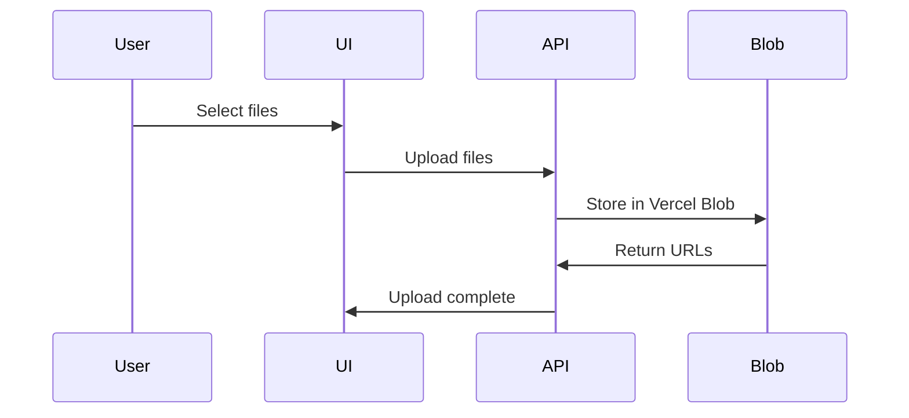
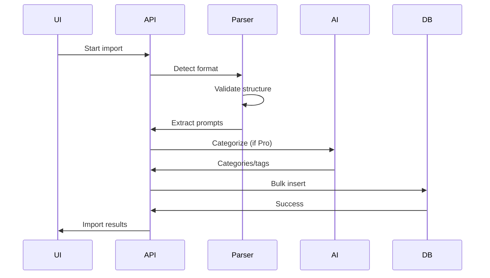

# PromptVault Import System Documentation

## Overview

The PromptVault import system is a comprehensive solution for migrating prompts from various LLM platforms and tools. It features automatic format detection, intelligent parsing, duplicate detection, and AI-powered categorization.

## Architecture

### System Components

```
Import System
├── Frontend Components
│   ├── ImportDialog (Main UI)
│   ├── Platform-specific dialogs
│   └── Progress tracking
├── File Upload
│   ├── Vercel Blob storage
│   └── Multi-file support
├── Import Parsers
│   ├── ChatGPT parser
│   ├── Claude parser
│   ├── Gemini parser
│   ├── Cline parser
│   ├── Cursor parser
│   └── Generic file parser
├── Processing Pipeline
│   ├── Validation
│   ├── Extraction
│   ├── Deduplication
│   └── AI categorization
└── Database Operations
    ├── Bulk insertion
    ├── Session tracking
    └── Error logging
```

## Supported Platforms

### 1. ChatGPT

**Export Format**: JSON
**File Location**: ChatGPT Settings → Data controls → Export data
**Parser**: `/src/lib/importers/chatgpt.ts`

#### Data Structure
```typescript
interface ChatGPTExport {
  conversations: Array<{
    id: string;
    title: string;
    create_time: number;
    mapping: {
      [key: string]: {
        message?: {
          author: { role: string };
          content: { parts: string[] };
        };
      };
    };
  }>;
}
```

#### Extraction Logic
- Traverses conversation tree structure
- Extracts only user messages
- Preserves conversation context
- Handles multi-part messages

### 2. Claude

**Export Formats**: 
- Claude App: JSON
- Claude Code (VS Code): JSONL

**Parser**: `/src/lib/importers/claude.ts`

#### Claude App Structure
```typescript
interface ClaudeExport {
  conversations: Array<{
    uuid: string;
    name: string;
    created_at: string;
    messages: Array<{
      role: 'human' | 'assistant';
      content: string;
    }>;
  }>;
}
```

#### Claude Code JSONL Format
```jsonl
{"uuid":"...","model":"claude-3","messages":[...]}
{"uuid":"...","model":"claude-3","messages":[...]}
```

### 3. Gemini

**Export Format**: JSON
**Source**: Google AI Studio
**Parser**: `/src/lib/importers/gemini.ts`

#### Data Structure
```typescript
interface GeminiExport {
  conversations: Array<{
    id: string;
    createTime: string;
    messages: Array<{
      author: string;
      content: string;
    }>;
  }>;
}
```

### 4. Cline (VS Code Extension)

**Export Format**: Markdown
**Parser**: `/src/lib/importers/cline.ts`

#### Markdown Structure
```markdown
# Task: [Task Name]
Date: [Timestamp]

## User
[User prompt content]

## Assistant
[Assistant response]

## User
[Follow-up prompt]
```

#### Parsing Features
- Task name extraction
- Timestamp parsing
- Multi-turn conversation support
- Code block preservation

### 5. Cursor IDE

**Export Format**: SQLite database
**Parser**: `/src/lib/importers/cursor.ts`

#### Database Schema
```sql
-- Conversations table
CREATE TABLE conversations (
  id TEXT PRIMARY KEY,
  title TEXT,
  timestamp INTEGER
);

-- Messages table
CREATE TABLE messages (
  conversation_id TEXT,
  role TEXT,
  content TEXT,
  timestamp INTEGER
);
```

### 6. Generic File Import

**Supported Formats**: JSON, TXT, CSV (planned)
**Parser**: Built into main importer

#### JSON Format
```json
[
  {
    "name": "Prompt Name",
    "content": "Prompt content",
    "metadata": { ... }
  }
]
```

#### Text Format
- Double newline separated prompts
- First line becomes prompt name
- Rest becomes content

## Import Process Flow

### 1. File Upload Stage



### 2. Processing Stage



## API Endpoints

### Upload Endpoint
```
POST /api/import/upload
```

Handles file upload to Vercel Blob storage.

**Request**: Multipart form data
```
file: File (max 10MB)
```

**Response**:
```json
{
  "url": "https://blob.vercel-storage.com/...",
  "pathname": "uploads/...",
  "contentType": "application/json"
}
```

### Bulk Import Endpoint
```
POST /api/import/bulk
```

Processes multiple files from various sources.

**Request**:
```json
{
  "files": [
    {
      "url": "blob_url",
      "source": "chatgpt",
      "name": "export.json"
    }
  ],
  "options": {
    "skipDuplicates": true,
    "autoCategize": true,
    "targetFolder": "imports"
  }
}
```

**Response**:
```json
{
  "success": true,
  "imported": 25,
  "skipped": 5,
  "errors": [],
  "warnings": ["5 duplicates found"],
  "sessionId": "uuid"
}
```

### Platform-Specific Endpoints

Each platform has its own endpoint for specialized handling:
- `/api/import/chatgpt`
- `/api/import/claude`
- `/api/import/gemini`
- `/api/import/cline`
- `/api/import/cursor`

## Parser Implementation

### Base Parser Interface

```typescript
export interface ExtractedPrompt {
  name: string;
  content: string;
  metadata: {
    source: ImportSource;
    conversationId: string;
    conversationTitle: string;
    timestamp: number;
    model?: string;
  };
}

export interface ImportResult {
  prompts: ExtractedPrompt[];
  errors: string[];
  warnings: string[];
}
```

### Parser Pattern

Each parser follows this pattern:

```typescript
// Validation function
export function validatePlatformExport(content: string): boolean {
  try {
    const data = JSON.parse(content);
    // Check for required fields
    return hasRequiredStructure(data);
  } catch {
    return false;
  }
}

// Parsing function
export function parsePlatformExport(content: string): ExtractedPrompt[] {
  const data = JSON.parse(content);
  const prompts: ExtractedPrompt[] = [];
  
  // Extract prompts from platform-specific structure
  // ...
  
  return prompts;
}
```

## Duplicate Detection

### Algorithm

```typescript
static detectDuplicates(
  newPrompts: ExtractedPrompt[], 
  existingPrompts: any[]
): {
  unique: ExtractedPrompt[];
  duplicates: ExtractedPrompt[];
} {
  const unique: ExtractedPrompt[] = [];
  const duplicates: ExtractedPrompt[] = [];

  for (const newPrompt of newPrompts) {
    // Exact content match
    const isDuplicate = existingPrompts.some(existing => 
      existing.content.trim() === newPrompt.content.trim()
    );

    if (isDuplicate) {
      duplicates.push(newPrompt);
    } else {
      unique.push(newPrompt);
    }
  }

  return { unique, duplicates };
}
```

### Future Enhancements
- Fuzzy matching for similar prompts
- Metadata-based deduplication
- User choice on duplicate handling

## AI Categorization (Pro/Enterprise)

### Categorization Process

```typescript
async function categorizePro<

s() {
  const response = await openai.chat.completions.create({
    model: 'gpt-4o-mini',
    messages: [
      {
        role: 'system',
        content: 'Analyze and categorize these prompts...'
      },
      {
        role: 'user',
        content: JSON.stringify(prompts)
      }
    ],
    response_format: { type: "json_object" }
  });
  
  return JSON.parse(response.choices[0].message.content);
}
```

### Categories Applied
- Development (API, debugging, code review)
- Content (writing, marketing, social)
- Analysis (data, research, planning)
- Creative (design, brainstorming)
- Support (customer service, documentation)

## Import Session Tracking

### Database Schema

```typescript
importSessions {
  id: uuid
  userId: text
  source: text
  importedCount: integer
  skippedCount: integer
  metadata: jsonb
  createdAt: timestamp
}
```

### Session Metadata

```json
{
  "fileCount": 5,
  "totalSize": 2048576,
  "processingTime": 3456,
  "errors": [],
  "warnings": [],
  "categorization": {
    "enabled": true,
    "promptsCategorized": 20
  }
}
```

## Error Handling

### Error Types

1. **File Errors**
   - File too large (>10MB)
   - Invalid format
   - Corrupted data
   - Unsupported encoding

2. **Parse Errors**
   - Missing required fields
   - Invalid JSON structure
   - Unexpected data format
   - Empty content

3. **Processing Errors**
   - Database connection issues
   - AI API failures
   - Rate limiting
   - Timeout errors

### Error Recovery

```typescript
try {
  // Attempt import
} catch (error) {
  if (error.code === 'FILE_TOO_LARGE') {
    // Suggest file splitting
  } else if (error.code === 'INVALID_FORMAT') {
    // Provide format guidance
  } else {
    // Log and report generic error
  }
}
```

## Performance Optimization

### Batch Processing

```typescript
const BATCH_SIZE = 50;

for (let i = 0; i < prompts.length; i += BATCH_SIZE) {
  const batch = prompts.slice(i, i + BATCH_SIZE);
  await processBatch(batch);
  
  // Progress update
  onProgress((i + batch.length) / prompts.length);
}
```

### Rate Limiting

- AI categorization: 20 requests/minute
- Database operations: Batched inserts
- File uploads: Concurrent limit of 5

## Security Considerations

### File Upload Security
- Max file size: 10MB
- Allowed MIME types validated
- Virus scanning (planned)
- Sandboxed parsing

### Content Validation
- HTML sanitization
- Script injection prevention
- SQL injection protection
- XSS prevention

### User Isolation
- Imports scoped to user
- No cross-user data access
- Session-based tracking
- Audit logging

## UI Components

### Main Import Dialog

```typescript
<ImportDialog
  isOpen={isOpen}
  onClose={onClose}
  onImportComplete={(count) => {
    toast.success(`Imported ${count} prompts`);
    refreshPrompts();
  }}
/>
```

### Platform-Specific Dialogs

Each platform has a specialized dialog:
- Step-by-step instructions
- Visual guides
- File format examples
- Troubleshooting tips

### Progress Tracking

```typescript
<ImportProgress
  current={processed}
  total={total}
  stage={stage}
  errors={errors}
/>
```

## Testing Import System

### Test Files

Located in `/test-files/`:
- `chatgpt-small.json` (5 conversations)
- `chatgpt-large.json` (100+ conversations)
- `claude-export.json`
- `claude-code.jsonl`
- `cline-task.md`
- `generic-prompts.json`

### Test Scenarios

1. **Single File Import**
   - Valid format
   - Invalid format
   - Empty file
   - Corrupted data

2. **Bulk Import**
   - Multiple platforms
   - Large files
   - Duplicate handling
   - Error recovery

3. **Edge Cases**
   - Unicode content
   - Very long prompts
   - Special characters
   - Nested conversations

## Future Enhancements

### Planned Features

1. **Direct API Integration**
   - OAuth with platforms
   - Automatic sync
   - Real-time updates

2. **Advanced Parsing**
   - Code extraction
   - Markdown preservation
   - Attachment handling

3. **Smart Deduplication**
   - Fuzzy matching
   - Semantic similarity
   - Version detection

4. **Export Functionality**
   - Export to any format
   - Selective export
   - Backup automation

### Platform Roadmap

- **Perplexity** import support
- **Anthropic Workbench** integration
- **Cohere Playground** support
- **Custom LLM platforms**

## Troubleshooting

### Common Issues

1. **Import Fails Silently**
   - Check browser console
   - Verify file size
   - Check network tab

2. **Prompts Not Appearing**
   - Refresh page
   - Check import session
   - Verify user tier

3. **Categorization Not Working**
   - Verify Pro/Enterprise tier
   - Check OpenAI API key
   - Review rate limits

### Debug Mode

Enable debug logging:
```typescript
localStorage.setItem('debug:import', 'true');
```

This logs:
- Parser selection
- Extraction details
- API requests
- Error details